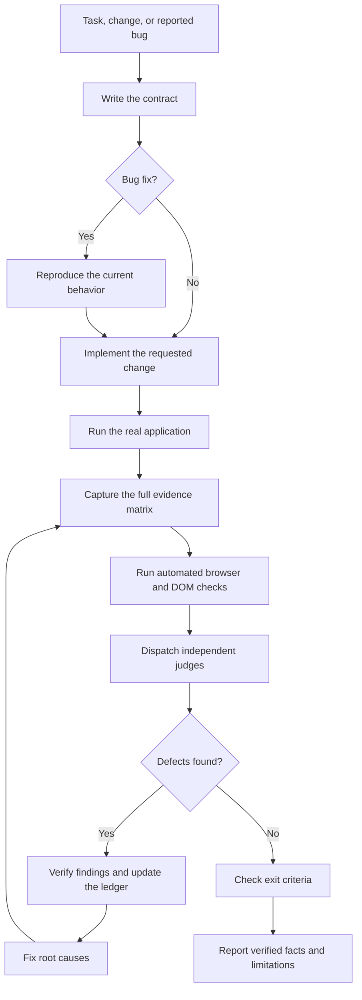
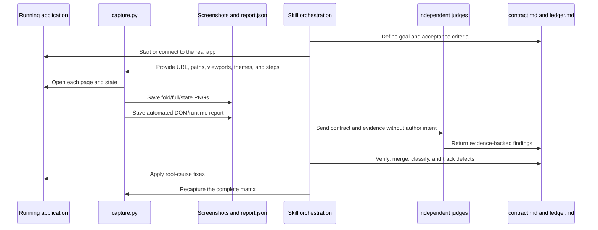
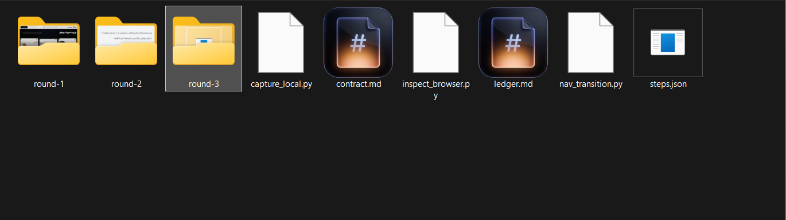
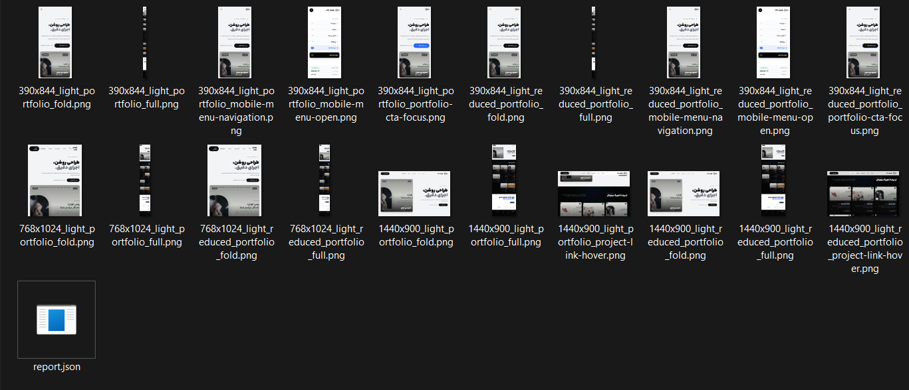
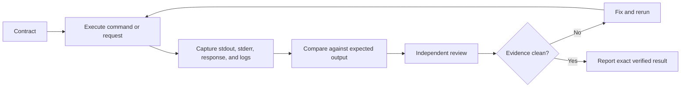

# Perfection Loop

[](https://skills.sh/mathofdynamic/perfection-loop)

Evidence-first verification for AI-assisted software work.

Perfection Loop is an Agent Skill that makes “done” a provable state. It gives an AI coding agent a repeatable way to define acceptance criteria, run the real application, capture the result, inspect it with independent reviewers, fix defects, and repeat until the final evidence is clean.

It is primarily designed for frontend and UI work, but the same method applies to any task where completion can be falsely claimed: tests, command-line tools, API changes, generated files, migrations, and release artifacts.

## Contents

- [The core idea](#the-core-idea)
- [What the skill contains](#what-the-skill-contains)
- [How the loop works](#how-the-loop-works)
- [The evidence model](#the-evidence-model)
- [How the capture script works](#how-the-capture-script-works)
- [How independent judges work](#how-independent-judges-work)
- [Using the supplied evidence](#using-the-supplied-evidence)
- [Quick start](#quick-start)
- [Capture options](#capture-options)
- [Interaction steps](#interaction-steps)
- [Exit criteria](#exit-criteria)
- [Non-visual work](#non-visual-work)
- [Installation](#installation)
- [Validation](#validation)
- [Limitations and boundaries](#limitations-and-boundaries)
- [Repository layout](#repository-layout)
- [License](#license)

## The core idea

Source code shows what an author wrote. A diff shows what changed. Neither proves what a user receives.

Perfection Loop treats the running result as the source of truth. The agent must inspect the actual browser output or other executable evidence, then use reviewers that do not receive the author’s reasoning or confidence. Every fix invalidates earlier evidence because a change that repairs one viewport or state can break another.

The important distinction is:

```text
implemented  !=  verified  !=  finished
```

The skill considers work finished only when the final verification round satisfies the contract, the automated checks are clean, and the defect ledger has no unresolved entries.

## What the skill contains

The package has four functional layers:

| Layer | File | Responsibility |
| --- | --- | --- |
| Agent instructions | `SKILL.md` | Defines when the skill applies, the loop, review rules, exit criteria, and honest reporting requirements. |
| Capture engine | `scripts/capture.py` | Drives a real Playwright browser, captures screenshots, and writes automated findings to `report.json`. |
| Review policy | `references/judges.md` | Supplies independent review prompts for requirements, layout, craft, UX, accessibility, motion, copy, technical quality, and regression. |
| Capture guidance | `references/capture.md` | Defines evidence quality, viewport/state matrices, naming, settling, and fallback behavior. |

The skill is an instruction and evidence workflow, not a test framework or a browser application. The agent orchestrates the complete process; the Python script supplies repeatable browser evidence.

## How the loop works

The lifecycle is intentionally cyclical. A defect sends the work back to a complete recapture, not a partial screenshot of the patched area.



### Step 0: Write the contract

The agent creates `.perfection/contract.md` before changing the target. The contract translates vague goals such as “make it polished” into checkable statements.

It records:

- the one-sentence goal;
- concrete acceptance criteria;
- the do-not-change list;
- the viewport, theme, motion, state, and flow matrix;
- the design mode: `Persuade`, `Operate`, `Read`, or `Experience`;
- locked decisions that judges must not reopen.

An acceptance criterion must be observable. For example:

```text
At 390x844, opening the mobile menu must reveal every navigation item without
horizontal overflow, and pressing Escape must close the menu and restore focus
to the menu button.
```

“Looks better” is not a contract. “The CTA remains visible and keyboard-focusable at 390x844” is.

### Step 1: Reproduce a bug before fixing it

For a reported bug, the agent captures the broken state first. The target is the same viewport, browser state, and interaction path as the report whenever those details are available.

This prevents a common failure mode: fixing an imagined cause, then declaring success without ever seeing the original failure.

### Step 2: Build or fix the smallest root cause

The implementation should respect the existing architecture, tokens, behavior, and scope. The loop is not permission to redesign unrelated parts of the product.

When a defect survives a patch, the agent should investigate the underlying constraint. For example, a clipped button may be caused by a fixed-width flex child, a parent overflow rule, a missing `min-width: 0`, or a breakpoint collision. Moving the button visually is not enough if the same root cause affects other states.

### Step 3: Capture the real result

The agent runs the actual dev server or built preview and gives the capture script its URL. It captures the full matrix from the contract, waits for the page to settle, and writes evidence under `.perfection/round-N/`.

The default matrix is:

| Viewport | Size | Typical purpose |
| --- | --- | --- |
| `mobile-375` | 375x812 | Narrow phone layout and touch behavior |
| `tablet-768` | 768x1024 | Tablet reflow and intermediate layout |
| `laptop-1280` | 1280x800 | Desktop working viewport |
| `desktop-1920` | 1920x1080 | Large-screen composition |

The contract can replace these with the actual sizes that matter. An in-between breakpoint such as 900px or 1024px is often more valuable than another wide screenshot.

### Step 4: Inspect with automated checks and human eyes

The capture script produces both pixels and structured findings. The agent must inspect the screenshots itself before judging them, describing what is literally visible rather than what it expected to see.

The automated report checks browser/runtime and DOM facts. The visual review checks hierarchy, alignment, density, copy, interaction states, accessibility clues, and motion source code that static screenshots cannot prove.

### Step 5: Judge independently

The judge prompts are designed to reduce author bias. Each reviewer receives the contract, evidence paths, relevant source, its own rubric, and the required output schema. It does not receive the author’s reasoning, expected result, or other judges’ opinions.

If sub-agent dispatch is available, judges run in parallel. Otherwise, the agent runs the judges as separate sequential passes and writes each report before starting the next.

### Step 6: Triage and fix

The agent verifies every judge finding against the cited screenshot or source. Hallucinated findings are marked `disputed` with evidence. Real findings are merged when they describe the same defect and entered into `.perfection/ledger.md`.

The agent fixes root causes, then returns to capture. It never rechecks only the component that changed. The full matrix is recaptured because the change may have affected a sibling, another viewport, a different theme, or an interaction state.

### Step 7: Exit honestly

The loop ends only when the exit criteria are satisfied. If visual verification was impossible, the report must say so. A build, HTTP 200, screenshot, or green unit test cannot be used as evidence for behavior it did not inspect.

## The evidence model

Each round has a clear role:



### What belongs in `.perfection/`

```text
.perfection/
├── contract.md                 # What “finished” means for this task
├── ledger.md                   # Defect history and current status
├── round-1/                    # First complete evidence pass
│   ├── ..._fold.png            # Above-the-fold screenshot
│   ├── ..._full.png            # Full-page screenshot
│   ├── ..._state.png           # Interaction-state screenshot
│   ├── report.json              # Automated checks and capture metadata
│   └── judge-A.md               # Independent judge report
├── round-2/                    # Evidence after a fix
└── round-N/                    # Final or subsequent rounds
```

The `.perfection/` directory belongs to the project under review, not to this skill repository. It should normally be ignored by that project’s Git configuration unless the evidence is intentionally part of a review artifact. Never place credentials, personal data, private source material, or sensitive production content in it.

### Defect statuses

The ledger uses these statuses:

| Status | Meaning |
| --- | --- |
| `open` | A verified defect still needs a fix. |
| `fixed` | A fix was applied but has not passed a later full review. |
| `verified` | A later review confirmed the defect is gone. |
| `disputed` | The finding was checked and could not be supported by the evidence. |
| `waived` | A P3 detail was intentionally accepted with a written reason. |

Severity is equally explicit:

| Severity | Meaning |
| --- | --- |
| `P0` | Broken, blocked, unreadable, missing, or the reported bug remains. |
| `P1` | Clearly wrong: overflow, overlap, clipping, contrast failure, broken state, or console error. |
| `P2` | Noticeably off: weak hierarchy, awkward wrap, inconsistent spacing, missing state, or jarring motion. |
| `P3` | Fine detail: small alignment or copy polish issue. |

## How the capture script works

`scripts/capture.py` is a deterministic baseline capture tool. It does not decide whether an interface is beautiful or complete; it produces evidence for the agent and judges.

### 1. It creates isolated browser contexts

For every viewport, theme, and motion mode, the script creates a fresh Playwright browser context. The context receives:

- the requested viewport dimensions;
- `light` or `dark` color scheme;
- `no-preference` or `reduce` motion preference;
- touch/mobile hints for widths of 500px or less.

This avoids relying on one browser state for every screenshot.

### 2. It waits for a settled page

For every path, the script:

1. navigates with `domcontentloaded`;
2. waits for network idle when possible;
3. waits for document fonts;
4. waits for a short settling period;
5. captures the above-the-fold view.

It then scrolls through the document to trigger scroll reveals and lazy-loaded assets, returns to the top, settles again, and captures a full-page screenshot.

### 3. It records runtime events

The script listens for:

- console errors and warnings;
- uncaught page errors;
- failed network requests;
- HTTP responses with status 400 or higher.

Those events are stored in `report.json` with the context that produced them.

### 4. It runs DOM checks

The baseline checks inspect:

- horizontal page overflow;
- elements extending past the viewport;
- interactive targets under 24px, and under 44px on narrow touch contexts;
- broken images;
- images without `alt` attributes;
- text below 12px;
- clipped text without ellipsis;
- missing `html lang`, title, or viewport metadata;
- a heading count other than one `h1`.

These are useful tripwires, not a complete accessibility audit.

### 5. It captures interaction steps

When `--steps steps.json` is provided, the script starts each step from a fresh navigation, settles the page, performs the declared actions, and saves a state screenshot. The base page checks remain in `report.json`; state screenshots are additional evidence that the judges must inspect.

### 6. It has deliberate exit semantics

The command exits with code `0` when capture succeeds, even if `report.json` contains findings. This allows the judges to receive the complete report. It exits with code `2` when the capture itself cannot run, such as a missing Playwright installation or a page that cannot load.

Therefore:

```text
exit code 0  = capture completed; inspect report.json
exit code 2  = capture failed; visual verification did not happen
```

## How independent judges work

The review panel is a set of prompts, not an opaque scoring model. Each judge has one responsibility:

| Judge | Owns |
| --- | --- |
| A | Requirements, original complaint, silent drops, and scope creep |
| B | Layout, containment, alignment, spacing, responsiveness, and imagery |
| C | Design craft, hierarchy, typography, color, consistency, and generic patterns |
| D | Interaction, feedback, forms, navigation, overlays, loading, and cognitive load |
| E | Accessibility, focus, keyboard use, semantics, contrast, zoom, and reduced motion |
| F | Motion purpose, timing, easing, transforms, performance, and reduced motion behavior |
| G | Labels, errors, empty states, terminology, grammar, and invented claims |
| H | Console, network, metadata, build output, automated report, and debug residue |
| I | Regression between the previous and current round; used from round 2 onward |

Every reported defect must include:

- a screenshot or source location;
- the viewport and state;
- the literal observation;
- the expected behavior;
- the concrete user impact;
- a fix direction;
- a confidence level.

Judges are not allowed to report taste preferences as defects. They must point to evidence or remain silent.

## Using the supplied evidence

The two screenshots in this repository show what a real Perfection Loop run looks like. They are illustrative evidence from a project review, not required filenames or a fixed project structure.

### Activity root



*The activity root shows three verification rounds alongside the contract, ledger, interaction scripts, and local inspection helpers. The important idea is persistence: the loop leaves an auditable trail instead of producing one disposable screenshot.*

The filenames in this example are project-specific. A project may use `capture_local.py` or `inspect_browser.py` in addition to the packaged `scripts/capture.py`; those helpers are not required by this repository.

### A populated capture round



*The capture round shows multiple viewport sizes, light and reduced-motion variants, fold and full-page captures, mobile menu states, CTA focus, project-link hover, and `report.json`. This is the shape of evidence required for a UI task with responsive and interactive behavior.*

The example uses `390x844`, `768x1024`, and `1440x900` rather than the default matrix. That is valid: the contract should use the sizes that expose the product’s real breakpoints. The `reduced` filenames show that reduced motion was captured as a separate behavior mode, not merely assumed to work.

## Quick start

### 1. Install capture dependencies

The capture helper uses Playwright and Chromium:

```bash
python -m pip install playwright
python -m playwright install chromium
```

On an externally managed Python installation, use the package-management procedure required by that environment.

### 2. Start the real application

Run the application with its normal development or preview command. The skill does not invent a mock page and `capture.py` does not start the application for you.

### 3. Capture the first round

Run the helper from the application project root:

```bash
python path/to/perfection-loop/scripts/capture.py \
  --url http://localhost:3000 \
  --out .perfection/round-1
```

PowerShell:

```powershell
python path/to/perfection-loop/scripts/capture.py `
  --url http://localhost:3000 `
  --out .perfection/round-1
```

### 4. Invoke the skill

Use the skill after the change or bug report:

```text
Use the perfection-loop skill to verify this change. Start from the real app,
capture the contract matrix, inspect the evidence, maintain the defect ledger,
and continue until the exit criteria are satisfied or report the blocker.
```

The agent should create `.perfection/contract.md`, run the capture helper, dispatch the appropriate judge panel, maintain `.perfection/ledger.md`, and repeat after every fix.

## Capture options

```bash
python path/to/perfection-loop/scripts/capture.py \
  --url http://localhost:3000 \
  --out .perfection/round-1 \
  --path / \
  --path /pricing \
  --viewports mobile-375,tablet-768,laptop-1280,desktop-1920 \
  --themes light,dark \
  --reduced-motion \
  --steps steps.json
```

Options:

| Option | Meaning |
| --- | --- |
| `--url` | Base URL of the running application. Required. |
| `--out` | Evidence directory. Required. |
| `--path` | Route to capture. Repeat it for multiple routes. Defaults to `/`. |
| `--viewports` | Comma-separated named or custom viewports such as `390x844`. |
| `--themes` | Comma-separated color schemes such as `light,dark`. |
| `--reduced-motion` | Adds a second capture pass with `prefers-reduced-motion: reduce`. |
| `--steps` | JSON file describing interaction states to photograph. |

Custom dimensions are useful for testing exact breakpoint boundaries:

```bash
python path/to/perfection-loop/scripts/capture.py \
  --url http://localhost:3000 \
  --out .perfection/round-1 \
  --viewports 390x844,768x1024,900x900,1440x900
```

## Interaction steps

`steps.json` makes important states reproducible:

```json
{
  "steps": [
    {
      "name": "mobile-menu-open",
      "viewports": ["mobile-375"],
      "actions": [
        { "click": "button[aria-label='Menu']" }
      ]
    },
    {
      "name": "login-error",
      "actions": [
        { "fill": ["#email", "not-an-email"] },
        { "press": "Tab" },
        { "click": "button[type=submit]" },
        { "wait": 300 }
      ]
    },
    {
      "name": "primary-cta-focus",
      "actions": [
        { "focus": ".hero .cta" }
      ]
    }
  ]
}
```

Supported actions are `click`, `hover`, `focus`, `fill`, `press`, `wait`, and `scroll`.

State coverage should reflect the product, not a checklist performed mechanically. Useful states include open menus, focus-visible controls, hover on fine pointers, validation errors, empty results, loading, success, long text, many items, and reduced motion.

## Exit criteria

The agent may report completion only when all of these are true:

- the last full recapture was made from the final code;
- the latest judge round found zero defects;
- the ledger contains no `open` or `fixed` entries;
- every acceptance criterion is checked with an evidence pointer;
- automated checks are clean;
- unsupported environments are explicitly listed as unverified.

The report must name what was not tested. Examples include real iOS Safari, a physical device, a screen reader, slow network, authenticated production data, third-party integrations, or a backend state that was not available locally.

### Anti-thrashing rules

The loop is strict, but it is not supposed to spin forever:

- If the same defect survives three fix attempts, revisit the diagnosis and try a structurally different solution.
- If two consecutive rounds do not reduce the open-defect count, reassess the approach.
- Stop at round 8 and report the remaining evidence-backed issues if the loop is still not converging.
- If two criteria conflict, preserve the contract and record the trade-off as a locked decision rather than trading defects between rounds.

## Non-visual work

For CLI, API, data, or infrastructure work, replace screenshots with executable evidence:



The same rule applies: never report success for a behavior that was not executed or an artifact that was not inspected.

## Installation

### Install from the public repository

Install the skill with the Vercel `skills` CLI:

```bash
npx skills add mathofdynamic/perfection-loop \
  --skill perfection-loop \
  --agent codex \
  --copy \
  --global \
  --yes
```

For Claude Code, install the same skill into the user-level Claude directory:

```bash
npx skills add mathofdynamic/perfection-loop \
  --skill perfection-loop \
  --agent claude-code \
  --copy \
  --global \
  --yes
```

For a project-local installation, remove `--global`. The CLI then installs into the current project’s agent skill directory. Start a new agent session after installation so it can discover the new skill.

### Install manually

Place the package directory at one of these locations:

```text
Project-local Codex skill:
<project>/.agents/skills/perfection-loop/

User-level Codex skill on Windows:
C:\Users\<user>\.codex\skills\perfection-loop\

User-level Codex skill on macOS/Linux:
~/.codex/skills/perfection-loop/
```

The directory must contain `SKILL.md` at its root. Supporting references and scripts remain relative to that file.

## Validation

Validate the source skill with the Codex skill validator:

```bash
python -B -X utf8 \
  <codex-home>/skills/.system/skill-creator/scripts/quick_validate.py \
  path/to/perfection-loop
```

Check the capture helper’s syntax and interface:

```bash
python -m py_compile scripts/capture.py
python scripts/capture.py --help
```

Before publishing changes, also check:

- the README renders correctly on GitHub;
- screenshot links return the intended assets;
- no credentials or private source data are included;
- `git diff --check` is clean;
- the final remote commit contains the intended tree;
- the capture script has been run against a real application when behavior is being claimed.

The validator checks skill structure, frontmatter, naming, and unfinished scaffolding. It does not prove that the workflow was effective on a real application. Only a real capture and review round can provide that evidence.

## Limitations and boundaries

Perfection Loop does not:

- start, deploy, or modify the application under review by itself;
- replace product requirements or design decisions;
- guarantee correctness outside the contract’s evidence matrix;
- replace security review, performance profiling, device testing, or assistive-technology testing;
- replace authenticated end-to-end testing when credentials or real data are required;
- make a screenshot prove keyboard, screen-reader, network, or backend behavior;
- automatically decide whether a judge finding is real;
- hide a failed capture behind a successful-looking report.

It is a quality gate and an evidence protocol. The quality of the result still depends on the contract, the matrix, the evidence, and the honesty of the final report.

## Repository layout

```text
perfection-loop/
├── SKILL.md                              # Agent instructions and routing
├── README.md                             # Human-facing documentation
├── LICENSE                               # MIT license
├── perfection-loop.skill                 # Packaged skill archive
├── references/
│   ├── capture.md                        # Evidence and capture guidance
│   └── judges.md                         # Independent review prompts
├── scripts/
│   └── capture.py                        # Playwright capture and DOM checks
└── docs/
    └── screenshots/
        ├── perfection-loop-activity-root.png
        └── perfection-loop-capture-round.png
```

The two documentation screenshots are part of this repository’s explanatory material. They are not required inputs for using the skill on another project.

## License

MIT. See [LICENSE](LICENSE).
